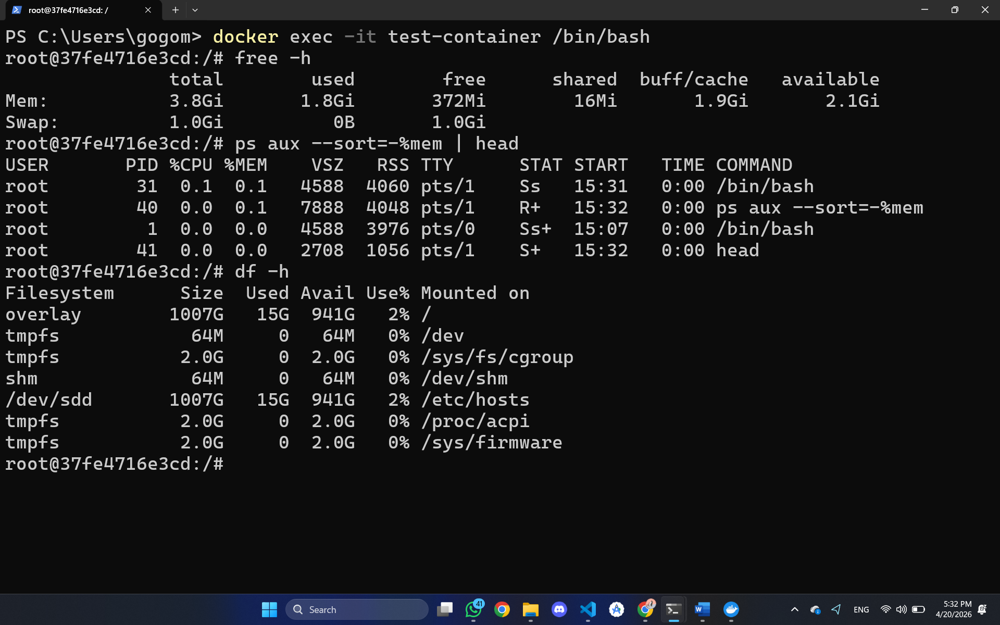
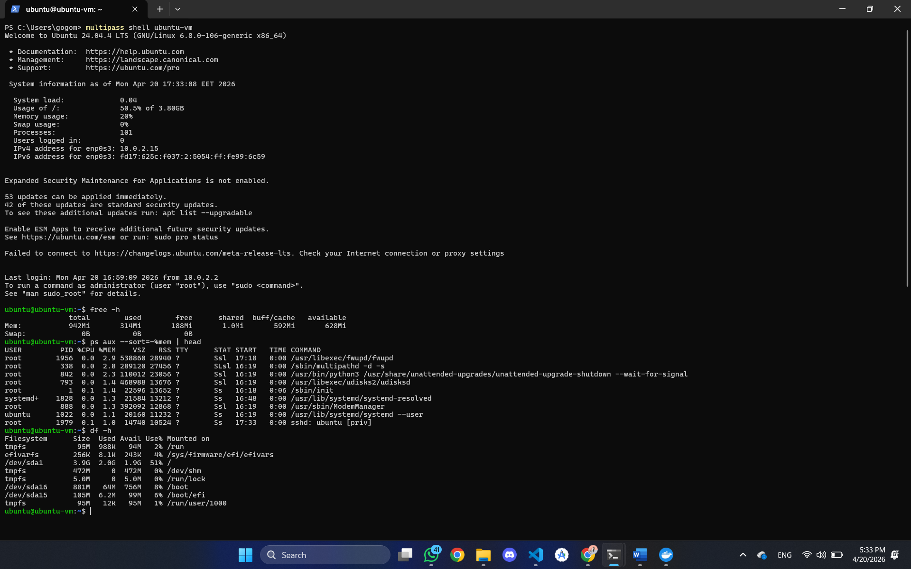
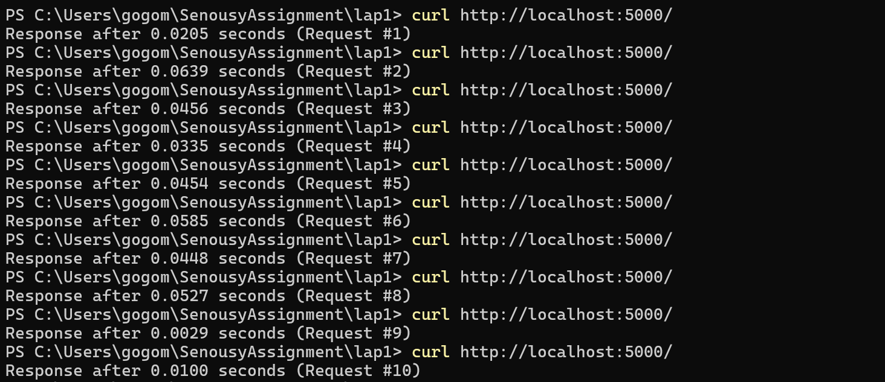
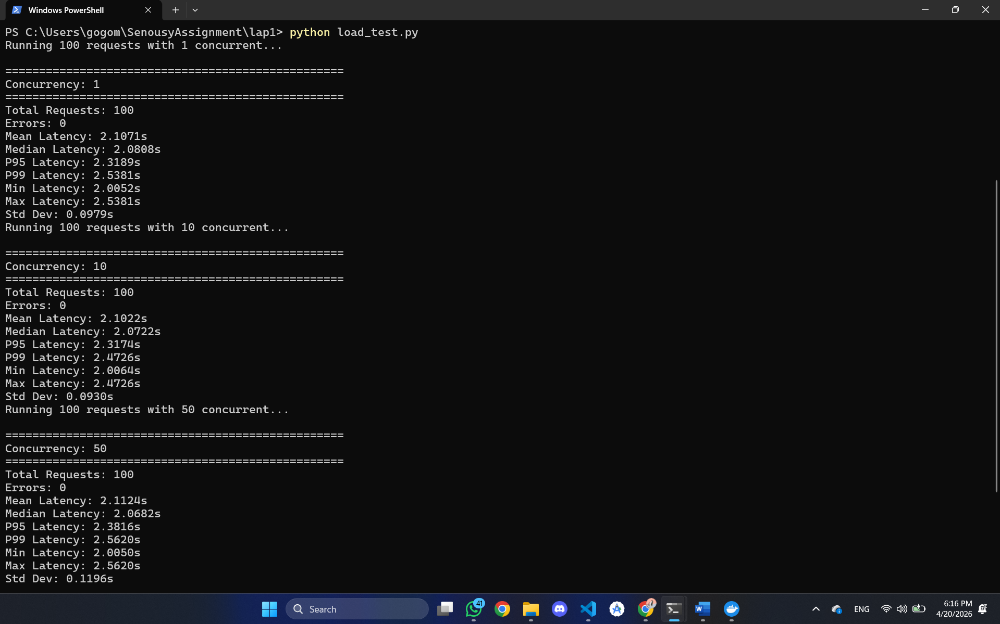
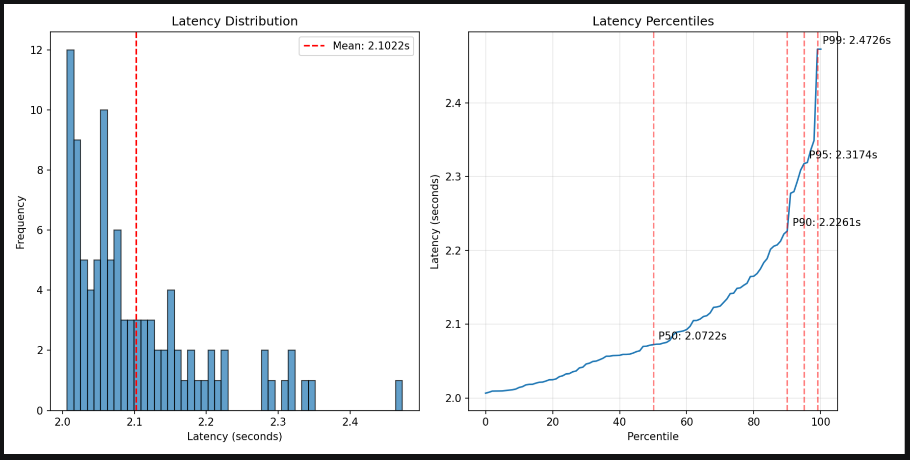
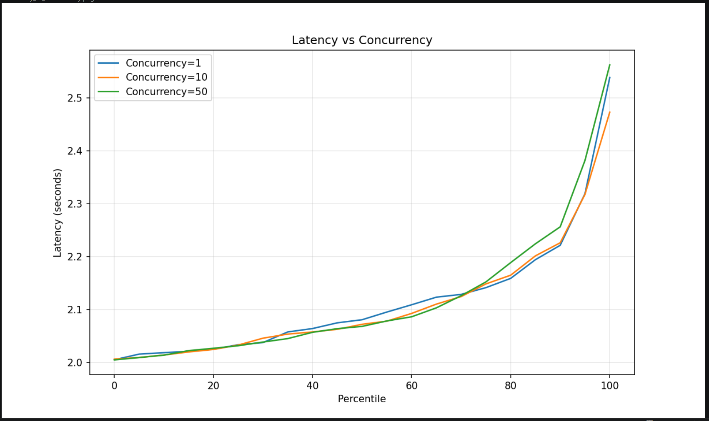

# Screenshots

Docker container resource usage showing memory, processes, and disk overlay from the host.

Figure: `01-container-resources.png`

---

Multipass VM resource usage showing isolated memory, disk, and the full OS process list.

Figure: `02-vm-resources.png`

---

Flask app responding to `curl` requests with simulated exponential delays.

Figure: `03-flask-curl-test.png`

---

Load test output showing latency statistics at different concurrency levels.

Figure: `04-load-test-results.png`

---

Histogram showing distribution of request latencies with tail latency visible on the right.

Figure: `05-latency-histogram.png`

---

Chart comparing mean, median, P95, and P99 latency across concurrency levels.

Figure: `06-latency-vs-concurrency.png`
