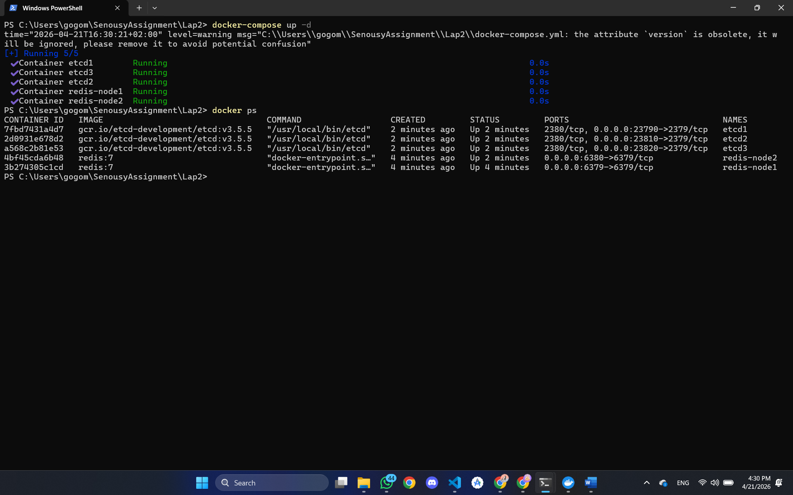
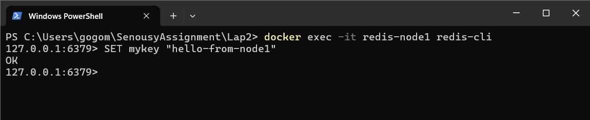
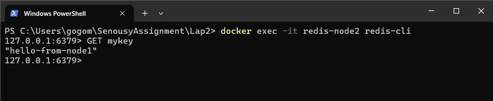
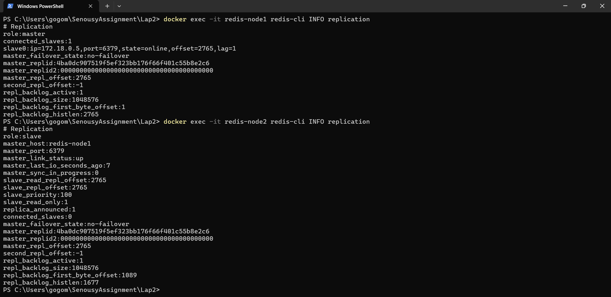
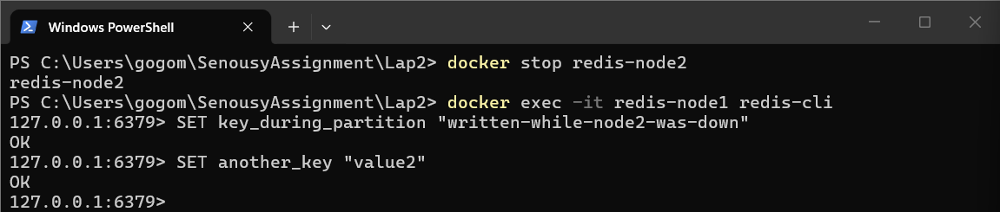
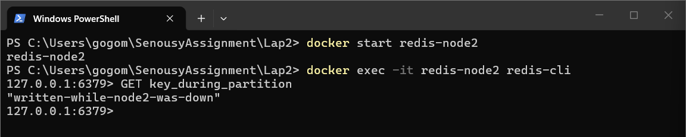
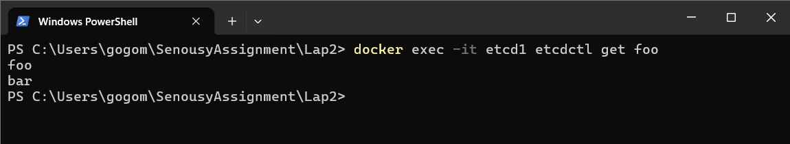
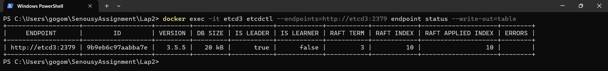
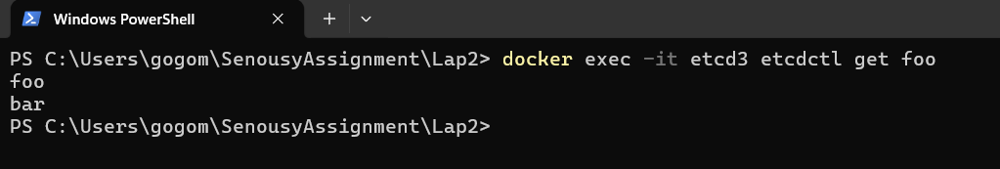

# Screenshots

All 5 containers running: `redis-node1`, `redis-node2`, `etcd1`, `etcd2`, and `etcd3`.

Figure: `01_containers_running.png`

---

Writing `SET mykey "hello-from-node1"` on `redis-node1` as the master and receiving `OK`.

Figure: `02_redis_set_master.png`

---

Reading `GET mykey` on `redis-node2` and receiving the replicated value from the master.

Figure: `03_redis_get_replica.png`

---

`INFO replication` on both Redis nodes showing `role:master`, `connected_slaves:1`, `role:slave`, and `master_link_status:up`.

Figure: `04_redis_replication_info.png`

---

Writes on `redis-node1` while `redis-node2` is stopped, showing the master remains available during the partition.

Figure: `05_redis_write_during_partition.png`

---

`redis-node2` reading `key_during_partition` after restart, proving eventual consistency after replication catches up.

Figure: `06_redis_eventual_consistency.png`

---

`etcdctl put foo bar` on `etcd1` returning `OK`.

Figure: `07_etcd_put.png`

---

`etcdctl get foo` on `etcd1` returning `foo` with value `bar`.

Figure: `08_etcd_get.png`

---

`endpoint status --write-out=table` showing the current etcd leader node and its Raft term and index.

Figure: `09_etcd_leader_before.png`

---

After killing the leader, a new leader is elected with a higher Raft term number.

Figure: `10_etcd_leader_after_failover.png`

---

`etcdctl get foo` after failover showing the data is still present.

Figure: `11_etcd_data_after_failover.png`
