# Screenshots

Interactive Ubuntu container showing `hostname`, `ps -ef`, `ip addr`, `mount | head`, and `cat /proc/1/cgroup` to demonstrate namespace and cgroup isolation.

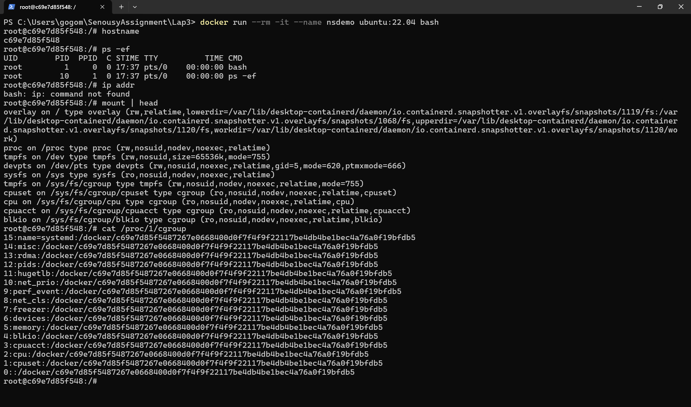

Figure: `01-namespaces-cgroups.png`

---

Side-by-side comparison of the container process view and the host PID of the same container process, showing PID namespace isolation.

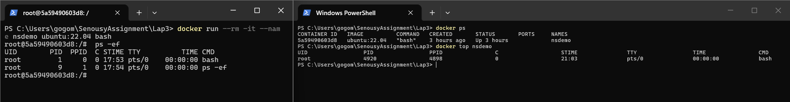

Figure: `02-pid-namespace-comparison.png`

---

`docker stats` output while running `stress` in a limited container, showing CPU capped near `0.5` and memory constrained near `256 MB`.

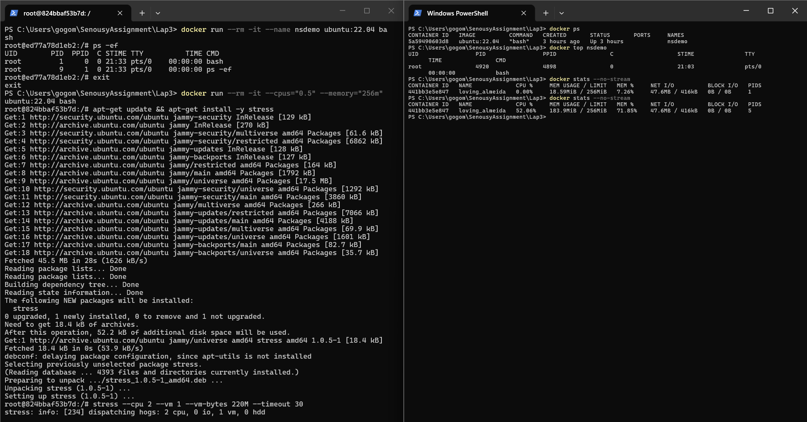

Figure: `03-cgroups-limits.png`

---

`docker history lab3-basic` and image listing for the basic single-stage Docker image.

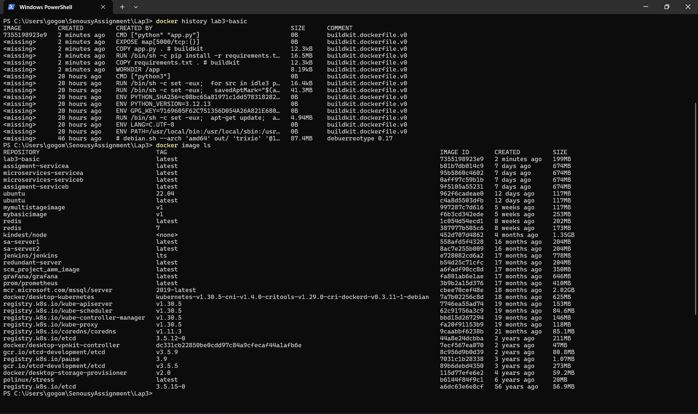

Figure: `04-basic-image-history.png`

---

Comparison of `lab3-basic` and `lab3-multi` in `docker image ls`, used to compare image size and layering.

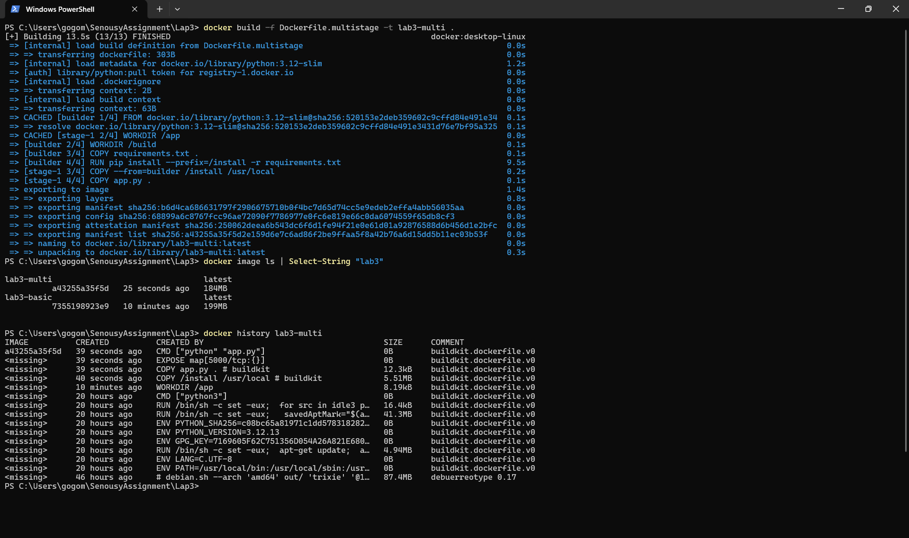

Figure: `05-image-comparison.png`

---

`kubectl get nodes -o wide` showing the local kind cluster node in `Ready` state.

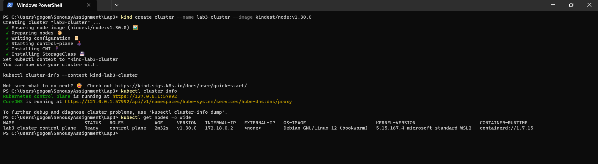

Figure: `06-kubernetes-cluster.png`

---

`kubectl get pods -o wide` showing all 3 `lab3-web` Pods in `Running` state.

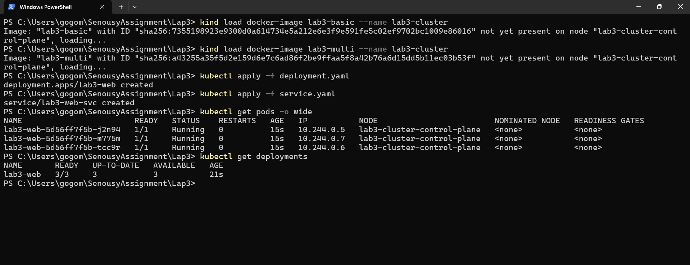

Figure: `07-kubernetes-pods-running.png`

---

Successful `curl` requests to `/` and `/health` through the forwarded Kubernetes service.

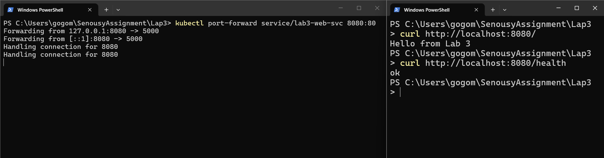

Figure: `08-service-curl-test.png`

---

`kubectl get nodes --show-labels` showing the applied `node-role=general` label.

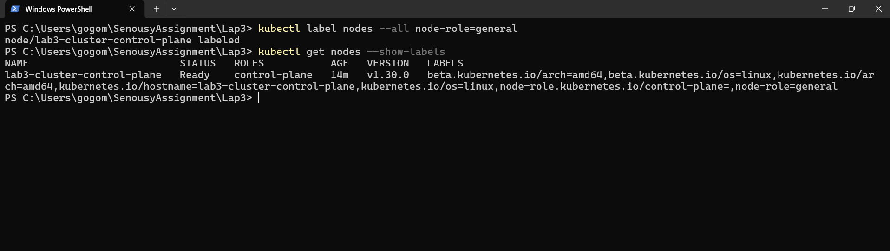

Figure: `09-node-labels.png`

---

Pod listing after reapplying the Deployment with `nodeSelector`, confirming scheduling against the labeled node.

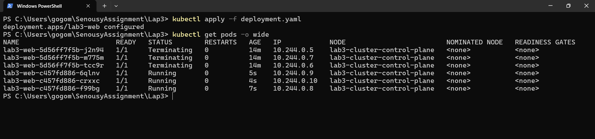

Figure: `10-pods-with-node-selector.png`

---

`kubectl get pods -w` showing a deleted Pod terminating and a replacement Pod being created to restore the desired replica count.

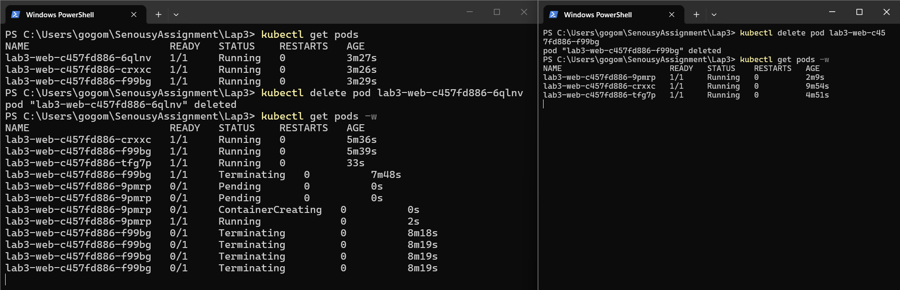

Figure: `11-pod-self-healing.png`

---

`kubectl describe pod` output showing readiness and liveness probe configuration and related events.

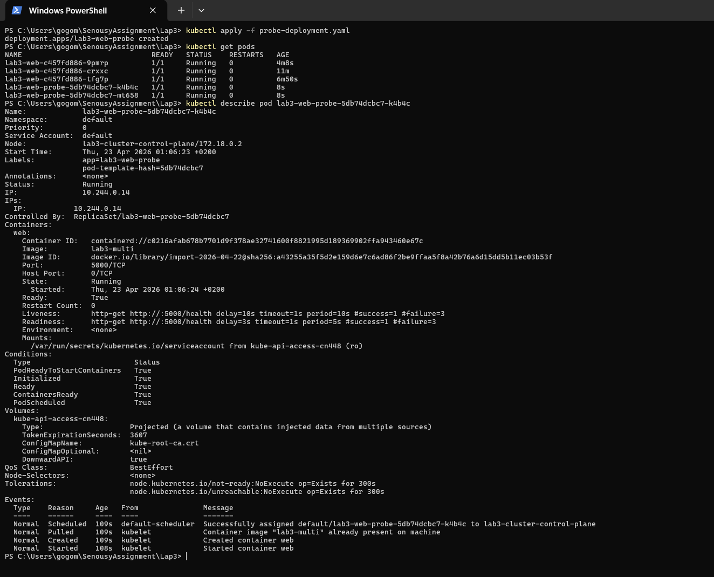

Figure: `12-probes-configured.png`

---

`kubectl get pods -w` showing the Pod staying the same while the container `RESTARTS` counter increments after killing PID 1.

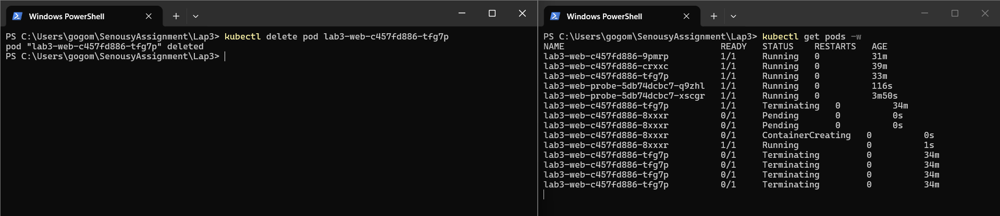

Figure: `13-container-restart.png`
