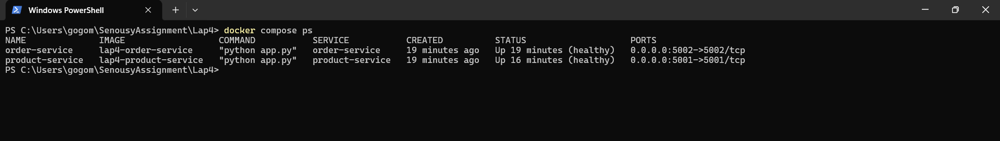
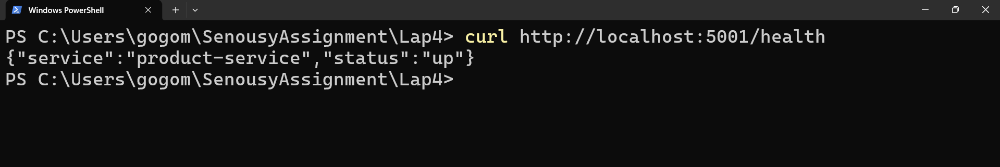
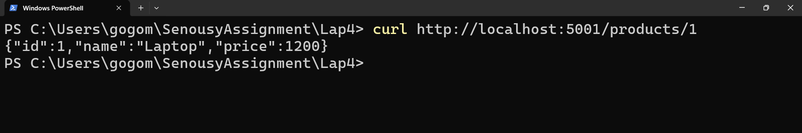
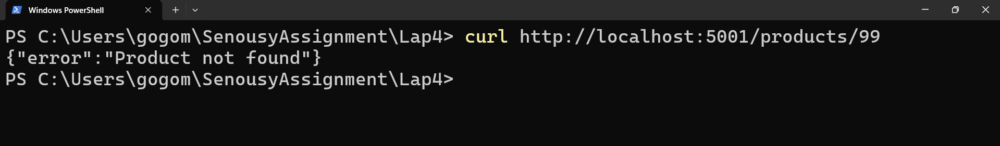
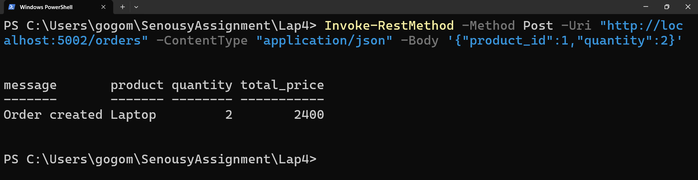
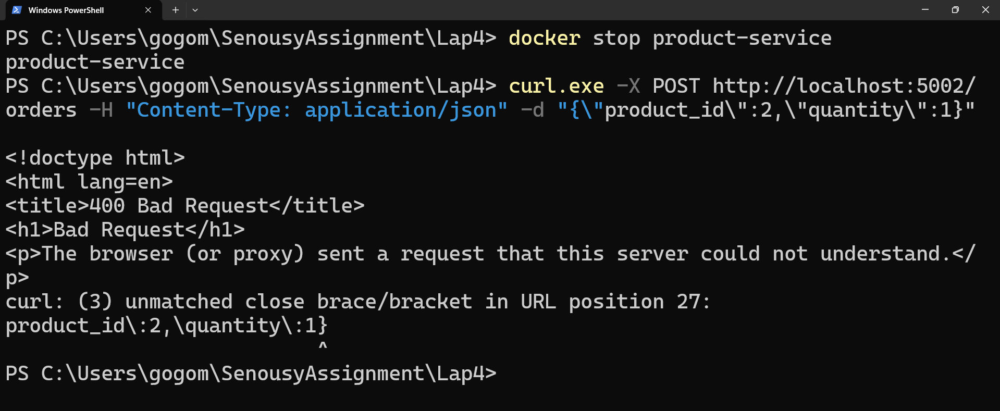
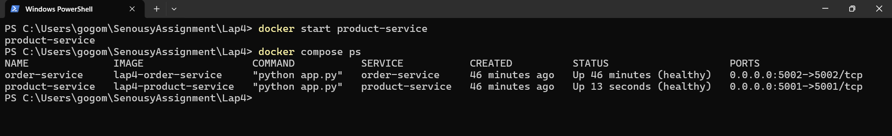

# Screenshots

`docker compose ps` showing both `product-service` and `order-service` running with exposed ports and healthy status.

Figure: `01-services-healthy.png`

---

Direct request to `http://localhost:5001/health` confirming that `product-service` is up.

Figure: `02-product-service-health.png`

---

Valid lookup request to `http://localhost:5001/products/1` returning the `Laptop` product data in JSON.

Figure: `03-product-lookup-valid.png`

---

Invalid lookup request to `http://localhost:5001/products/99` returning `Product not found`.

Figure: `04-product-lookup-invalid.png`

---

Initial `POST /orders` attempt from PowerShell returning `400 Bad Request` due to request formatting, included to document the issue encountered during testing.

Figure: `05-order-post-bad-request.png`

---

Failure injection step after stopping `product-service`, showing degraded behavior when `order-service` can no longer reach its dependency.

Figure: `07-product-service-stopped.png`

---

Final `docker compose ps` output after restarting `product-service`, showing the services restored.

Figure: `09-services-restored.png`
