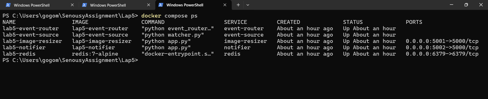
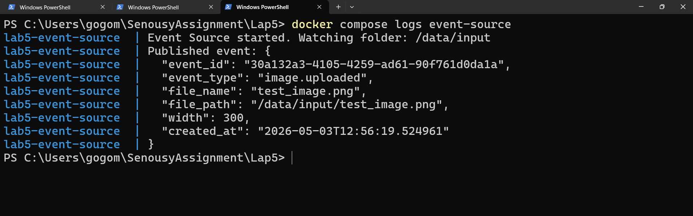
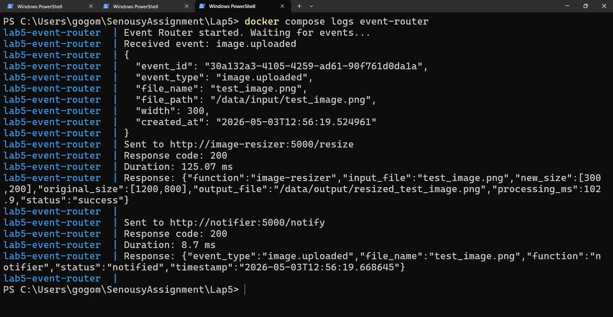
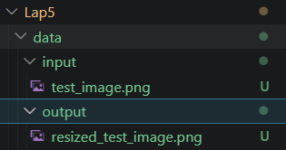

# Screenshots

`docker compose ps` showing all containers running: `redis`, `event-source`, `event-router`, `image-resizer`, and `notifier`.

Figure: `01-running-containers.png`

---

`docker compose logs event-source` showing that a new image was detected and an `image.uploaded` event was published to Redis Streams.

Figure: `02-event-source-logs.png`

---

`docker compose logs event-router` showing that the router received the event and forwarded it to both `image-resizer` and `notifier`.

Figure: `03-event-router-logs.png`

---

Screenshot of the `data` folder showing both `input` and `output` directories, including the generated resized image in the output folder.

Figure: `04-output-image.png`

---